# 🌌 THE OMEGA CODEBASE CONSCIOUSNESS: HOLOGRAPHIC BLUEPRINT

*SYSTEM IDENTITY: Dart / Flutter / Gemma 4 (On-Device Local Inference) / Agentic Architecture*

Welcome to the Omega Blueprint. This document maps the visible code and the invisible connections (Side Effects) of the `apex_lite` agentic system in exhaustive detail. Review this matrix before making any surgical modifications. Not a single dependency or hidden logic flow has been omitted.

---

## 🌀 PHASE 1: THE HOLOGRAPHIC MAP

This comprehensive dependency graph reveals exactly how the system is wired at the file and function level. 
- `==>` denotes **Hard Dependencies** (Structural integrity; if A breaks, B dies).
- `-.->` denotes **Soft Dependencies** (Events, Optional UI components).

```mermaid
flowchart TD
  %% Root Application
  subgraph src_root ["📂 lib/"]
    M[main.dart:main]
  end

  %% UI Layer
  subgraph src_ui_faces ["📂 lib/ui/faces/"]
    GS[gajraj_scaffold.dart:_GajrajOracleScaffoldState]
    MP[model_picker_screen.dart]
  end

  subgraph src_ui_widgets ["📂 lib/ui/widgets/"]
    CB[chat_bubble.dart]
    MB[markdown_bubble.dart]
    TC[tool_card.dart]
    AD[activity_drawer.dart]
    SD[session_drawer.dart]
    SE[sandbox_explorer.dart]
    CT[collapsible_thought.dart]
  end

  %% Core Heartbeat & Routing
  subgraph src_core_infrastructure_heartbeat ["📂 lib/core/infrastructure/heartbeat/"]
    AC[aether_core.dart:AetherCore]
  end

  subgraph src_core_infrastructure_router ["📂 lib/core/infrastructure/router/"]
    AR[agent_router.dart:AgentRouter]
  end

  %% Core Services & Security
  subgraph src_core_infrastructure_services ["📂 lib/core/infrastructure/services/"]
    LIS[local_inference_service.dart:LocalInferenceService]
    SM[session_manager.dart:SessionManager]
    IDS[id_service.dart:IdService]
    PU[process_utils.dart:ProcessUtils]
  end

  subgraph src_core_infrastructure_security ["📂 lib/core/infrastructure/security/"]
    SP[sentry_purity.dart:SentryPurity]
    PJ[path_jailer.dart:PathJailer]
  end
  
  subgraph src_core_infrastructure_prompts ["📂 lib/core/infrastructure/prompts/"]
    KB[kharwal_behavior.dart:KharwalBehavior]
  end

  subgraph src_core_infrastructure_handshake ["📂 lib/core/infrastructure/handshake/"]
    CP[cipher_protocol.dart:CipherProtocol]
  end

  %% Core Tools
  subgraph src_core_infrastructure_tools ["📂 lib/core/infrastructure/tools/"]
    BT[bash_tool.dart:BashTool]
    SO[spectral_ops.dart:SpectralOps]
    FWT[file_write_tool.dart:FileWriteTool]
    FRT[file_read_tool.dart:FileReadTool]
    DBT[directory_briefing_tool.dart:DirectoryBriefingTool]
    VMT[voice_munshi_tool.dart:VoiceMunshiTool]
    DIT[data_injector_tool.dart:DataInjectorTool]
    NAT[notification_agent_tool.dart:NotificationAgentTool]
  end

  %% Domain Entities
  subgraph src_core_domain_entities ["📂 lib/core/domain/entities/"]
    MSG[message.dart:Message]
    TE[tool_entities.dart:ToolRequest/Result]
    IE[inference_event.dart:InferenceEvent]
    PM[protocol_mode.dart:ProtocolMode]
    IEV[input_event.dart:InputEvent]
    TER[tool_execution_record.dart:ToolExecutionRecord]
  end

  subgraph src_core_domain_interfaces ["📂 lib/core/domain/interfaces/"]
    IT[i_tool.dart:ITool]
    IIA[i_input_adapter.dart:IInputAdapter]
  end

  %% --------------------------------
  %% Hard Dependencies (==>)
  %% --------------------------------
  M ==> AC
  M ==> LIS
  M ==> SM
  M ==> GS
  M ==> MP
  M ==> BT
  M ==> DBT
  M ==> FRT
  M ==> FWT
  M ==> DIT
  M ==> NAT
  M ==> VMT
  
  AC ==> AR
  AC ==> LIS
  AC ==> CP
  AC ==> TE
  AC ==> MSG
  AC ==> IE
  AC ==> IDS
  
  AR ==> SP
  AR ==> TE
  AR ==> IT
  
  LIS ==> IE
  LIS ==> MSG
  LIS ==> TE
  
  SP ==> PJ
  SP ==> TE
  
  SO ==> PJ
  SO ==> PU
  SO ==> TE
  
  BT ==> SO
  BT ==> IT
  
  DIT ==> SO
  
  GS ==> AC
  GS ==> SM
  GS ==> KB
  GS ==> SO
  GS ==> CB
  GS ==> TC
  GS ==> SD
  GS ==> AD
  GS ==> CT
  GS ==> MSG
  GS ==> IEV
  
  SM ==> MSG
  SM ==> TER
  SM ==> PM
  SM ==> IDS
  
  CP ==> TE
  CP ==> IDS

  %% --------------------------------
  %% Soft Dependencies (-.->)
  %% --------------------------------
  AC -.-> IEV
  GS -.-> SE
```



---

## ⚠️ PHASE 2: THE "IMPACT MATRIX" (The Missing Link)

Review these Ripple Effects meticulously before making any surgical modifications to prevent the "I fixed one bug but created two more" syndrome.

| If you modify... | You MUST also check... | Because... |
| :--- | :--- | :--- |
| `agent_router.dart:getToolDefinitionsFlat` | `local_inference_service.dart:_buildResponseStream` | The native `flutter_gemma` SDK `createChat(tools:)` parameter relies entirely on the flat schema map. Deeply nesting tool definitions will cause the LiteRT-LM model to crash or hallucinate tool calls. |
| `sentry_purity.dart:_dangerousOps` | `agent_router.dart:executeTools` & `path_jailer.dart` | Adjusting blocklists immediately affects what `bash_tool` can execute. Blocking `rm` prevents self-correction if the agent creates bad files. |
| `spectral_ops.dart:execute` | `bash_tool.dart:run` | Modifying the background Isolate PID tracking (`_activePids`) or `maxConcurrentPids` will cause fatal deadlocks in bash execution if orphans aren't reaped correctly using `kill -0`. |
| `spectral_ops.dart:_readHeadTail` | `agent_router.dart:executeSingleTool` | If `maxMemoryChars` is changed to return >30KB directly to the LLM, the 32K context window of Gemma 4 will overflow, crashing the `top_p_cpu_sampler` in C++. |
| `message.dart:toJson` | `session_manager.dart:loadSession` | Changing the JSON serialization schema (e.g., modifying `audioBytes` handling) will break existing persisted chat histories and crash the app on boot during `json.decode`. |
| `inference_event.dart` | `aether_core.dart:_runInternalPulse` | Adding new `InferenceEvent` types (sealed class) requires updating the type-matching stream yield loop inside `aether_core.dart`, otherwise events will be swallowed silently. |
| `local_inference_service.dart:_preprocessImageBytes` | `gajraj_scaffold.dart:_handleSend` | The UI sends raw bytes. If you change `_maxImageDimension` (currently 512px) to a higher resolution, Gemma 4 will generate >280 visual patches, causing a `clEnqueueMapBuffer -14` WebGPU crash. |
| `aether_core.dart:streamingFutures` | `agent_router.dart:executeSingleTool` | Mid-stream tool execution stores futures in `streamingFutures`. Changing the event emission order in `aether_core.dart` will cause "Zombie Tools" that execute but never return their results to the LLM context. |

---

## 🧬 PHASE 3: THE "DATA DNA" (Single Source of Truth)

The exact JSON structures and volatile variables that power the system.

### Schema Snapshots

**`Message` (JSON Persisted Model - `lib/core/domain/entities/message.dart`)**
```json
{
  "uuid": "String (Unique ID)",
  "role": "MessageRole Enum (user | assistant | system | tool)",
  "content": "String (Text or Tool Output)",
  "imagePath": "String? (Null if no image)",
  "audioPath": "String? (Null if ephemeral voice)",
  "audioBytes": "String? (Base64 Encoded Uint8List)",
  "isCompacted": "Boolean (True if summarized)",
  "isProactive": "Boolean",
  "toolUseId": "String? (Matches ToolRequest ID)",
  "isError": "Boolean? (True if tool failed)",
  "metadata": {
    "tool_name": "String (Required for SDK mapping)",
    "is_read_only": "Boolean",
    "input_type": "String (image | voice | text)"
  },
  "timestamp": "String (ISO-8601)"
}
```

**`ToolRequest` & `ToolResult` (Runtime Volatile - `lib/core/domain/entities/tool_entities.dart`)**
```json
// ToolRequest
{ 
  "id": "String (UUID for matching)", 
  "name": "String (e.g., 'bash')", 
  "params": "Map<String, dynamic> (e.g., {'command': 'ls -la'})" 
}

// ToolResult
{ 
  "toolUseId": "String (Matches Request ID)", 
  "content": "String (Command output or error log)", 
  "isError": "Boolean", 
  "errorType": "ToolErrorType Enum (none | timeout | validation | execution | network | security)" 
}
```

**`InferenceEvent` (Sealed Stream Interface - `lib/core/domain/entities/inference_event.dart`)**
- `TextToken(String token)`: Delta stream chunk.
- `ThinkingToken(String content)`: Internal reasoning chunk (`<channel>thought`).
- `ToolCallEvent(String name, Map<String, dynamic> args)`: Native function call decoded by SDK.
- `FatalErrorEvent(String message)`: Engine crash requiring reload.
- `RecoverableErrorEvent(String message)`: LiteRT-LM prefill error (Silently retried).
- `StreamTimeoutEvent(String message, Duration timeoutDuration)`: Model hung, prefill timeout.

### Variable Scope Warnings
> ⚠️ **Global State Mutex**: `_globalEngineLock` in `local_inference_service.dart` is a static `Completer<void>?`. Do NOT bypass this lock. On-device LLMs are strictly single-threaded; concurrent inference requests will cause a hard SIGSEGV crash.
> ⚠️ **Context Scope**: `streamingFutures` in `aether_core.dart` is locally scoped within the `_runInternalPulse` loop. Do not rely on global arrays to track active tools.
> ⚠️ **State Consistency**: `currentTurn` and `executionHistory` in `agent_router.dart` are volatile State properties updated exclusively by `aether_core.dart`. Do NOT overwrite them asynchronously from UI widgets.

---

## 🧠 PHASE 4: THE "LOGIC KERNEL" (The Algorithm)

The autonomous Agentic Pulse is located in `aether_core.dart` -> `_runInternalPulse`.

### The Core Loop (Plain English)
1. **Input & Context Assembly**: Listen for `InputEvent` (Text/Image/Voice) via `IInputAdapter`. Add to the `history` array. Check `_calcAdaptiveTurnDepth` to prevent runaway agentic loops (caps turns based on prompt complexity).
2. **Context Compaction**: Strip raw audio bytes (`_stripAudioFromHistory`), truncate previous AI verbosity to 200 chars (`_trimHistory`), and periodically inject Sandbox Directory trees (`_injectSandboxContext`) so the 2B model doesn't hallucinate missing files.
3. **Engine Invocation (Mutex Guarded)**: Call `LocalInferenceService.getResponseStream`. Wait for the `_globalEngineLock`.
4. **Stream Processing & Heart-Snatch**: 
   - Yield `TextToken` and `ThinkingToken` to the UI immediately.
   - If a `ToolCallEvent` is emitted natively by the SDK, parse the args.
   - **Heart-Snatch (Mid-Stream Execution)**: *DO NOT wait for the stream to finish.* Immediately dispatch safe tools to `AgentRouter` concurrently while the LLM is still typing. Store the Futures in `streamingFutures`.
5. **Tool Evaluation (Sibling Abort)**: Wait for the LLM stream to finish, then await all tool Futures. If `executeTools` detects a `bash` tool failure, it triggers a **Sibling Abort**, instantly cancelling subsequent tools in the batch to prevent cascaded destruction.
6. **Recovery & Recursion**: Inject specific `ToolResult`s into the history. If tools failed, inject specific error-correction prompts (e.g., "try mkdir -p"). If the model outputs empty text or encounters a `RecoverableErrorEvent`, trigger the **Error Withholding Pattern**. Recursively repeat Step 3 until the model outputs a final text response with zero tool calls.

### Hidden Logic & Edge Cases
- **Error Withholding Pattern**: `RecoverableErrorEvent`s and `StreamTimeoutEvent`s are *hidden* from the user. The UI continuously displays "Thinking..." while `AetherCore` silently triggers an **exponential backoff with jitter** (`backoffMs * 0.2 * Random`) to retry inference.
- **GPU to CPU Auto-Fallback**: Inside `local_inference_service.dart`, `_isGpuSpecificError` scans for strings like `QUEUE_BUFFER_TIMEOUT` or `clEnqueueMapBuffer`. If found, `_gpuFailed` is flagged, and the system seamlessly restarts the inference on the CPU without user intervention. Tracks across prompts and applies permanent CPU mode after 3 consecutive failures.
- **Infinite Loop Detection**: Inside `spectral_ops.dart`, `_detectInfiniteLoop` scans the `tempFile` output. If >90% of lines are identical duplicates, it forcefully sends `SIGKILL` to the process and returns an error to the LLM to prevent storage exhaustion.
- **Repeated Error Ejection**: Inside `aether_core.dart`, if the exact same tool error message occurs twice in a row (`_sameErrorCount >= 2`), a hard system prompt is injected forcing the LLM to completely abandon its current approach (e.g., "You MUST use a completely different approach").

---

## 🛡️ PHASE 5: THE CODING CONSTITUTION (Rules of Engagement)

Adhere strictly to these architectural rules when modifying `apex_lite`:

1. **Strictly use async/await.** Never use `.then()` chains for tool execution. Background isolate processes in `spectral_ops.dart` require clean `try/catch/finally` blocks to guarantee `_reapOrphans()` is called.
2. **No Magic Strings for Model Invocation.** Never construct raw `<|tool_call|>` XML manually in system prompts. Rely entirely on the native `createChat(tools:)` format provided by `flutter_gemma`. Manual prompt-engineering of tools triggers the Gemma 4 RLHF safety refusals ("I am an AI, I cannot access files").
3. **Strict Path Jailing.** All file operations MUST route through `PathJailer.isPathSafe`. Do not attempt to read or write to `/sdcard` or `~/Downloads` directly. The sandbox root is absolute and immutable.
4. **Tool Output Persistence.** If a tool's output exceeds 5000 characters, it MUST be written to disk (e.g., `output_timestamp.log`) and only a truncated preview returned in the `ToolResult`. Flooding the LLM with a 10MB JSON response will instantly crash the C++ sampler.
5. **Concurrent Process Cap.** `SpectralOps` limits concurrent active PIDs to 50 (`maxConcurrentPids`). Do not spawn detached background processes without adding them to `_activePids`.
6. **Error Handling & Specificity.** Log to console using `Logger` AND return clean `ToolResult(isError: true)`. Do NOT return generic "Execution failed" messages to the LLM. You must parse the exit code and provide specific guidance (e.g., "Exit Code 127: Command not found. Did you mean 'ls'?").
7. **Zero-UI Recovery.** Transient inference errors must be suppressed via the Withholding Pattern. Never show a snackbar or error banner for a recoverable prefill timeout.

***

*OMEGA SCAN COMPLETE. NO SIDE-EFFECT UNDETECTED. Proceed with surgical modifications.*
